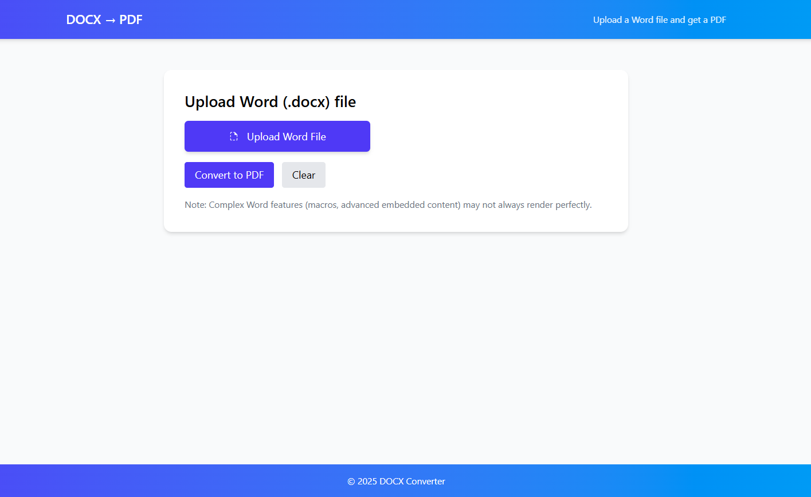

 # DOCX to PDF Converter (React + Node.js)

This project allows users to upload a Word (.docx) file via a React frontend, send it to a Node.js backend, and receive a PDF version of the document.
The backend uses Mammoth to extract text & images from DOCX, and Puppeteer to render it into a printable PDF.

 # Features
Upload .docx files from the browser
Convert DOCX → PDF using server-side rendering
Download the converted PDF instantly
Handles basic formatting, text, and images
Simple UI with loading indicator

# Screenshot  

# Tech Stack
Frontend
React
Axios
Tailwind CSS
React Icons
Backend
Node.js + Express
Multer (file uploads)
Mammoth (DOCX to HTML)
Puppeteer (HTML to PDF)
CORS

# Installation & Setup

git clone https://github.com/sujoy9830/docx-to-pdf.git
cd docx-to-pdf
cd backend
npm install
node server.js
cd frontend
npm install
npm run dev

# Usage
Open the frontend in your browser.
Click "Upload Word File" and select a .docx file.
Click "Convert to PDF".
The PDF will be downloaded automatically after conversion.
